# üóΩ NYC Yellow Taxi Trip Data Analytics Project (focused on Transportation Application of Data Analytics)

**Project Duration:** June 2025  
**Dataset Size:** ~4.3M rows √ó 20 columns `yellow_tripdata_2025-06.parquet`(.parquet format)  
**Project Type:** Real-World, End-to-End Data Analytics with Community Collaboration  (This project explores NYC Yellow Taxi trip data to uncover patterns in passenger behavior, trip fares, tips, and congestion trends using Python and pandas.)

## üìä Columns Explained

| **Column Name**         | **Description**                                                                                   |
| ----------------------- | ------------------------------------------------------------------------------------------------- |
| `VendorID`              | Code for the provider (1 = Creative Mobile Technologies, 2 = VeriFone Inc, 4/5/7 = Other vendors) |
| `tpep_pickup_datetime`  | Date and time when the trip started (pickup)                                                      |
| `tpep_dropoff_datetime` | Date and time when the trip ended (drop-off)                                                      |
| `passenger_count`       | Number of passengers in the taxi                                                                  |
| `trip_distance`         | Total distance of the trip in miles                                                               |
| `RatecodeID`            | Rate code used for fare calculation (1 = Standard, 2 = JFK, etc.)                                 |
| `store_and_fwd_flag`    | 'Y' if the trip record was stored in the taxi’s memory before sending; 'N' otherwise              |
| `PULocationID`          | TLC Taxi Zone ID where the trip started (pickup location)                                         |
| `DOLocationID`          | TLC Taxi Zone ID where the trip ended (drop-off location)                                         |
| `payment_type`          | Method used to pay: 1 = Credit card, 2 = Cash, 3 = No charge, etc.                                |
| `fare_amount`           | Fare for the trip before extra fees and surcharges                                                |
| `extra`                 | Extra charges (e.g., for rush hour or night travel)                                               |
| `mta_tax`               | \$0.50 Metropolitan Transportation Authority tax per trip                                         |
| `tip_amount`            | Tip amount paid by the passenger (non-zero usually for card payments)                             |
| `tolls_amount`          | Amount paid for tolls during the trip                                                             |
| `improvement_surcharge` | \$0.30 fee for taxi improvement projects (added to each trip)                                     |
| `total_amount`          | Total amount paid by the customer (fare + all charges + tips)                                     |
| `congestion_surcharge`  | Fee added for trips below 96th St in Manhattan (usually \$2.75)                                   |
| `Airport_fee`           | Flat fee for pickups from airports (like JFK, LaGuardia)                                          |
| `cbd_congestion_fee`    | Congestion fee for entering Manhattan’s Central Business District                                 |


Step 1: Define the Problem Statement
Step 2: Understand the Business Context
Step 3: Data Collection
Step 4: Data Inspection & Loading
Step 5: Data Cleaning
Step 6: Feature Understanding
Step 7: Data Transformation
Step 8: Exploratory Data Analysis (EDA)
Step 9: Advanced Insights
Step 10: Geospatial Mapping (Optional)
Step 11: Machine Learning
Step 12: Data Visualization & Storytelling
Step 13: Publishing & GitHub Upload
Step 14: Decision Making & Actions


---

## ‚úÖ Step 1: Define the Problem Statement

**Goal:** Uncover meaningful insights from NYC Yellow Taxi trip data — such as peak demand hours, tipping behavior, airport ride patterns, and cost breakdowns — using scalable analytics workflows.

### Key Questions:

1- When are most taxi rides occurring (peak hours)?
2- How do payment types affect tip amounts & which method is most commonly preferred by customers?
3- Are there differences in fare trends between weekdays and weekends?
4- What are the most frequent pickup and dropoff locations?
5- Can we build features like trip duration, speed or surge indicators?


### Answers (after complete analysis):

## 1- üìà Answer:
According to our analysis of NYC Yellow Taxi trip data for June 2025, the peak ride demand occurs between 3:00 PM and 7:00 PM.
üïí Top Peak Hours Identified:
Highest trip volumes observed during: 3:00 PM to 7:00 PM (Consistent daily spikes in this evening window)
üîç Why This Happens:
This time frame aligns with the end of standard office hours (9:00 AM to 4:00 PM). As workers leave offices, demand for taxis increases sharply — especially in business districts like Midtown and Downtown Manhattan.

Refrences : ├── figure_1 A2 Rides by Hour of Day (Data Visualization)
            ├── figure_1 Heatmap Number of Rides by Day and Hour (Advance Visualization)
            ├── figure_3 Total Passenger by Hour (Time Series Data Analysis)
            ├── nyc_taxi_data_analysis.py
            ├── DataVisualization.py
            ├── AdvancedVisualization.py
            ├── TimeSeriesDataAnalysis.py


## 2- üìà Answer: 
This analysis revealed that payment type significantly impacts ride & tipping behavior. Specifically:
üí≥ Credit card payments are associated with: 
Credit cards are the overwhelmingly preferred payment method (85.8 %) with Higher average tip amounts (4.43 $)
Tip Frequency 93.39%
Greater likelihood of leaving a tip
üíµ Cash payments tend to show:
Lower recorded tips ( 0.0004 $ Avg ) possibly due to offline tipping
Analysis of 4.3 million taxi rides shows that both tipping behavior and payment preferences strongly favor Credit Cards (Refrenced by PyCharm Console Result Table).

Refrences : ├── Figure_1.1 Trip Frequency by Payment Type (DataVisualizationForTip)
            ├── Figure_1 Average Tip Amount by Payment Type (DataVisualizationForTip)
            ├── Figure_4 Distribution of Payment Types (Blue: Credit Card) (TimeSeriesDataAnalysis)
            ├── Figure_5 Daily Trends in Payment Types (TimeSeriesDataAnalysis)
            ├── payment_type_distribution (Type 1: Credit Card) (nyc_taxi_eda_pipeline)
            ├── Figure_3.2 Feature Importance XGBoost (nyc_taxi_fare_prediction_ML)
            ├── Figure_4 Feature Importance Random Forest (nyc_taxi_fare_prediction_ML)
            ├── DataVisualizationForTip.py
            ├── nyc_taxi_eda_pipeline.py
            ├── nyc_taxi_fare_prediction_ML.py
            ├── TimeSeriesDataAnalysis.py
           

## 3- üìà Answer: 
Yes — our analysis confirms clear differences in fare patterns between weekdays and weekends. While the average fare remains similar, we observe notable variations in trip distance, rider behavior and volume. 
## Console O/P
|  **Day Type**           |          **Avg Fare ($)**          |             **Avg Tip ($)**        |        **Avg Distance (mi)**       |      **Total Rides**        |
| ----------------------- | ---------------------------------- | ---------------------------------- | ---------------------------------- | --------------------------- |
| Weekday                 |               20	               |                3.83                |               3.42                 |          "2,182,054"        |
| Weekend                 |               20.37	               |                3.72                |               3.74                 |          "796,350"          |

While weekend rides are slightly more expensive and cover longer distances, the average tips are marginally lower than weekdays — possibly due to higher fare base and more leisure/non-work-related trips.

## 
|  **Day**           |          **Avg Fare ($)**          |             **Avg Tip ($)**        |        **Avg Distance (mi)**       |
| ------------------ | ---------------------------------- | ---------------------------------- | ---------------------------------- | 
| Mondday            |               20.35                |                3.86                |               3.71                 |
| Tuesday            |               19.46	          |                3.81                |               3.32                 |
| Wednesday          |               20.24                |                3.82                |               3.21                 |
| Thursday           |               19.9	          |                3.88                |               3.35                 |
| Friday             |               20.05	          |                3.78                |               3.51                 |
| Saturday           |               19.13	          |                3.51                |               3.37                 |
| Friday             |               21.52	          |                3.92                |               4.09                 |

Sunday stands out with the highest fare, longest rides, and highest tipping — likely reflecting longer, leisure-focused trips, airport transfers, or post-weekend travel.

Refrences : ├── Figure_1 Average Fare Weekdays vs Weekends (DataVisualizationFareTrends)
            ├── Figure_7 Daily Average Trip Distance (TimeSeriesDataAnalysis)
            ├── Figure_1 B2 Fare Amount vs Trip Distance (DataVisualization) 
            ├── Figure_1 Average Fare Amount Over Time (AdvancedVisualizations)
            ├── Figure_1 A4 Average Fare by Day of Week (DataVisualization)
            ├── DataVisualizationFareTrends (Console O/P)
            ├── DataVisualizationFareTrends.py
            ├── DataVisualizations.py
            ├── AdvancedVisualization.py
            ├── TimeSeriesDataAnalysis.py
           

## 4- üìà Answer: 
Airports (JFK & LaGuardia) are major pickup points but not as dominant for drop-offs ‚Üí indicating tourists and business travelers arriving more than departing in taxis.
## 
|  **Zone**                        |          **total_rides**          |  
| -------------------------------- | --------------------------------- | 
| JFK Airport                      |               171194              |
| Upper East Side South            |               154916	           |
| Midetown Center                  |               147111              | 
| Upper East Side North            |               128834	           |  
| Penn Station/Madison Sq West     |              110812               | 
| Midtown East                     |               109940	           |
| LaGuardia Airport                |               109905	           |
| Times Sq/Theatre District        |               101763	           | 
| Lincoln Square East              |               91611	           |
| Murray Hill                      |               88751	           |

Midtown & Times Square areas dominate both lists due to high tourist activity, business hubs, and entertainment venues.
Upper East Side (both North & South) appears in top positions for both pickups and dropoffs ‚Üí likely affluent residential demand.

## 
|  **Zone**                        |          **total_rides**          |  
| -------------------------------- | --------------------------------- | 
| Upper East Side South            |               137227              |
| Upper East Side North            |               136889	           |
| Midetown Center                  |               117612              | 
| Times Sq/Theatre Distric         |               96575	           |  
| Midtown East                     |               88228	           | 
| Murray Hill                      |               87752	           |
| Upper West Side South            |               82373	           |
| Lincoln Square East              |               81400	           | 
| Lenox Hill West                  |               78051	           |
| East Chelsea                     |               77715	           |

Refrences : ├── Figure_1 Top 10 Pickup Location in NYC (June 2025) (TopPickupDropoffLocationsAnalysis)
            ├── Figure_2 Figure_1 Top 10 Dropoff Locations in NYC (June 2025) (TopPickupDropoffLocationsAnalysis)
            ├── TopPickupDropoffLocationsAnalysis.py
            ├── yellow_tripdata_2025-06_cleaned.parquet
            ├── taxi+_zone_lookup.csv
            ├── Top_10_Dropoff_Locations.csv (got from output)  
            ├── Top_10_Pickup_Locations.csv (got from output)

## 5- üìà Answer: 
Yes — the data strongly supports building features for trip duration, average speed and surge indicators.

├─ Trip Duration Patterns
Graph Reference: fare_vs_duration
Insight: Most trips are short, under 20 minutes, with a steep drop in frequency for longer rides.
A small percentage of very long trips suggests either intercity travel or anomalies (possible driver waiting times or recording errors).

├─ Speed Variations by Hour
Graph Reference: fare_vs_distance + Average Trip Distance by Hour
Insight: Speeds are highest during off-peak hours (late night & early morning).
Significant drops during rush hours (7–9 AM and 4–6 PM) due to traffic congestion.
Lowest speeds align with high-demand periods, which impacts ETAs and customer satisfaction.

├─ Surge-like Indicator (Demand Heatmap by Day & Hour)
Graph Reference: hourly_trip_metrics + Average Trip Distance by Hour
Insight: Evening peaks (5–8 PM weekdays, late nights on weekends) dominate demand.
Morning commute shows smaller peaks compared to evenings.
Lowest demand is consistently 3–5 AM daily.

Refrences : ├── Average Speed by Hour of Day (Q5visualization)
            ├── Trip Demand Heatmap by Day and Hour (Q5visualization)
            ├── Trip Duration Distribution (Minutes) (Q5visualization)
            ├── yellow_tripdata_2025-06_cleaned.parquet
            ├── NYC_Taxi_with_Features.csv
         
---

## ‚úÖ Step 2: Understand the Business Context

- **Domain:** Urban Transportation & Public Mobility
- **Stakeholders:** Taxi companies, planners, analysts, passengers
- **Tools:** Python, Pandas, Seaborn, PyArrow, Gamma App, GitHub


# 1 - Answer's 🧠 Business Implication:
Taxi operators and mobility platforms can: Prioritize driver dispatch and dynamic pricing in these hours
                                           Strategically position vehicles near office zones to capture evening demand
                              Data Source: Trip count grouped by pickup hour from 4.3M rides in June 2025 (tpep_pickup_datetime ‚Üí .dt.hour) (Data Transformation)
                              
# 2 - Answer's 🧠 Business Implication:
Digital payments (especially credit cards) dominate both in usage and tipping behavior. Riders who pay via credit card are over 13,000x more likely to leave a tip compared to cash. Digital tipping is clearly favored, likely due to in-app prompts and ease of entry. 
Encourage and prioritize digital payment systems to enhance driver earnings and customer experience. Tip-based incentive programs should be optimized around card-paying customers.

# 3 - Answer's 🧠 Business Implication:
Weekends ‚Üí Longer trips, slightly higher fares, fewer total rides
Sundays ‚Üí Opportunity for surge pricing, leisure promotions, or targeted services
Weekdays ‚Üí Bulk of the volume; optimize driver distribution during peak office hours
Use time-based pricing, weekend promos and targeted driver placement to maximize revenue across different day types.

# 4 - Answer's 🧠 Business Implication:
Driver Allocation: Position drivers at JFK and LaGuardia during peak flight hours and in Midtown during rush hours.
Pricing Strategy: Implement zone-based surge pricing for high-demand areas like Times Square, Midtown Center and Upper East Side.
Tourism Services: Partnership opportunities with hotels, airports, and event organizers in these top areas.
Customer Experience: Offer pre-booking or fixed-fare services from airports to popular dropoff neighborhoods.

# 5 - Answer's 🧠 Business Implication:
Duration can be a predictive feature for pricing and supply planning.
Outlier filtering can improve model accuracy and operational reliability.
Average speed can serve as an indicator of congestion and expected delays.
Useful for dynamic ETAs and real-time fare adjustments.
Surge indicators can be derived from high-demand vs low-supply time blocks.
Helps optimize driver shift allocation and surge pricing to balance demand.
These features can improve fare prediction accuracy, optimize driver allocation and enhance customer experience by predicting congestion and wait times.

---

## ‚úÖ Step 3: Data Collection

- **Source:** NYC Taxi & Limousine Commission (TLC)
- **File:** `yellow_tripdata_2025-06.parquet`
- **Why Parquet?** Fast, compressed, scalable format

```python
import pandas as pd
# df = pd.read_csv("yellow_tripdata_2025-06.csv") // if data in .csv file
df = pd.read_parquet('yellow_tripdata_2025-06.parquet', engine='pyarrow')
# we can use either 'pyarrow' or 'fastparquet' as the engine
# df = pd.read_parquet("yellow_tripdata_2025-06_cleaned.parquet") for cleaned data
print(df.columns)
'''
Index(['VendorID', 'tpep_pickup_datetime', 'tpep_dropoff_datetime','passenger_count', 'trip_distance', 'RatecodeID', 'store_and_fwd_flag','PULocationID', 'DOLocationID', 'payment_type', 'fare_amount', 'extra',
       'mta_tax', 'tip_amount', 'tolls_amount', 'improvement_surcharge','total_amount', 'congestion_surcharge', 'Airport_fee','cbd_congestion_fee'], dtype='object')

'''

# Save cleaned dataset
df.to_parquet('yellow_tripdata_2025-06_cleaned.parquet')      
```
Refrences : ├── nyc_taxi_data_analysis & all .py files (Use data collection)
            | 
---

## ‚úÖ Step 4: Data Inspection & Loading

- Loaded dataset
- Viewed shape, columns, data types
```python

print(df.head())
'''
    VendorID tpep_pickup_datetime  ... Airport_fee  cbd_congestion_fee
0         1  2025-06-01 00:02:50  ...        1.75                0.75
1         2  2025-06-01 00:11:27  ...        0.00                0.75
2         1  2025-06-01 00:43:47  ...        0.00                0.75
3         1  2025-06-01 00:01:15  ...        0.00                0.75
4         7  2025-06-01 00:16:32  ...        0.00                0.75
'''
print(df.shape)
# (4322960, 20)
print(df.info())
'''
<class 'pandas.core.frame.DataFrame'>
RangeIndex: 4322960 entries, 0 to 4322959
Data columns (total 20 columns):
 #   Column                 Dtype         
---  ------                 -----         
 0   VendorID               int32         
 1   tpep_pickup_datetime   datetime64[us]
 2   tpep_dropoff_datetime  datetime64[us]
 3   passenger_count        float64       
 4   trip_distance          float64       
 5   RatecodeID             float64       
 6   store_and_fwd_flag     object        
 7   PULocationID           int32         
 8   DOLocationID           int32         
 9   payment_type           int64         
 10  fare_amount            float64       
 11  extra                  float64       
 12  mta_tax                float64       
 13  tip_amount             float64       
 14  tolls_amount           float64       
 15  improvement_surcharge  float64       
 16  total_amount           float64       
 17  congestion_surcharge   float64       
 18  Airport_fee            float64       
 19  cbd_congestion_fee     float64       
dtypes: datetime64[us](2), float64(13), int32(3), int64(1), object(1)
memory usage: 610.2+ MB
None
Process finished with exit code 0
'''
print(df.describe())
'''
VendorID  ... cbd_congestion_fee
count  4.322960e+06  ...       4.322960e+06
mean   1.887364e+00  ...       5.332318e-01
min    1.000000e+00  ...      -7.500000e-01
25%    2.000000e+00  ...       0.000000e+00
50%    2.000000e+00  ...       7.500000e-01
75%    2.000000e+00  ...       7.500000e-01
max    7.000000e+00  ...       1.250000e+00
std    7.588800e-01  ...       3.585827e-01
[8 rows x 19 columns]
Process finished with exit code 0
'''

   
```
Refrences : ├── nyc_taxi_data_analysis.py
            | 
---
---

## ‚úÖ Step 5: Data Cleaning

- Handled nulls
- Fixed datatypes
- Removed invalid records

```python
########## Referenced from nyc_taxi_data_analysis.py
# Nulls
print(df.isnull().sum())

# Drop Duplicates
df = df.drop_duplicates()

# Remove invalid rows
df = df[df['trip_distance'] > 0]
df = df[df['passenger_count'] > 0]
df = df[df['fare_amount'] >= 0]

# Fix passenger count (replace zeros with median)
median_passenger = df['passenger_count'].median()
df.loc[df['passenger_count'] == 0, 'passenger_count'

########## outlier_detection
# Remove invalid entries
df = df[(df['fare_amount'] > 0) & (df['trip_distance'] > 0) & (df['trip_duration_minutes'] > 0)]

########## nyc_taxi_fare_prediction & nyc_taxi_full_pipeline 
# Drop rows with missing values in features or target
df = df.dropna(subset=features + [target])

```
Refrences : ├── nyc_taxi_data_analysis.py
            ├── outlier_detection.py
            ├── nyc_taxi_fare_prediction.py
            ├── nyc_taxi_full_pipeline.py
         
---

## ‚úÖ Step 6: Feature Understanding

20 original columns including:
- `trip_distance`, `tip_amount`, `payment_type`, `fare_amount`, `congestion_surcharge`
```python
import pandas as pd
import matplotlib.pyplot as plt
import seaborn as sns


df = pd.read_parquet("yellow_tripdata_2025-06_cleaned.parquet")

# Columns: tpep_pickup_datetime, tpep_dropoff_datetime, trip_distance, fare_amount

# Ensure datetime format
df['tpep_pickup_datetime'] = pd.to_datetime(df['tpep_pickup_datetime'])
df['tpep_dropoff_datetime'] = pd.to_datetime(df['tpep_dropoff_datetime'])

# Creating day of week column 
# df['tpep_pickup_datetime'] = pd.to_datetime(df['tpep_pickup_datetime'])
df['day_of_week'] = df['tpep_pickup_datetime'].dt.day_name()

# Create weekday/weekend column
df['day_type'] = df['day_of_week'].apply(lambda x: 'Weekend' if x in ['Saturday', 'Sunday'] else 'Weekday')

# Create output directory for charts
os.makedirs("outputs/eda_charts", exist_ok=True)

# Create Trip Duration (minutes)
df['trip_duration_min'] = (df['tpep_dropoff_datetime'] - df['tpep_pickup_datetime']).dt.total_seconds() / 60

# Filter out unrealistic trips
df = df[(df['trip_duration_min'] > 0) & (df['trip_duration_min'] < 300)]  # less than 5 hours

# Create Average Speed (mph)
df['avg_speed_mph'] = df['trip_distance'] / (df['trip_duration_min'] / 60)
df = df[(df['avg_speed_mph'] > 0) & (df['avg_speed_mph'] < 80)]  # filter unrealistic speeds

# Create Surge-like Indicator
df['hour'] = df['tpep_pickup_datetime'].dt.hour
df['day_of_week'] = df['tpep_pickup_datetime'].dt.day_name()

# Mark surge hours (Morning 8-9 AM, Evening 3-7 PM)
df['surge_flag'] = df['hour'].apply(lambda x: 1 if (8 <= x <= 9) or (15 <= x <= 19) else 0)

# Load your cleaned dataset
df = pd.read_parquet('yellow_tripdata_2025-06_cleaned.parquet')

# Feature Engineering
df['pickup_datetime'] = pd.to_datetime(df['tpep_pickup_datetime'])
df['dropoff_datetime'] = pd.to_datetime(df['tpep_dropoff_datetime'])

df['trip_duration'] = (df['dropoff_datetime'] - df['pickup_datetime']).dt.total_seconds() / 60  # minutes
df['pickup_hour'] = df['pickup_datetime'].dt.hour
df['day_of_week'] = df['pickup_datetime'].dt.day_name()
df['trip_speed_mph'] = df['trip_distance'] / (df['trip_duration'] / 60)

df['is_weekend'] = df['day_of_week'].isin(['Saturday', 'Sunday'])
df['rush_hour_flag'] = df['pickup_hour'].isin([7, 8, 9, 16, 17, 18])

def time_of_day(hour):
    if 5 <= hour < 12:
        return 'Morning'
    elif 12 <= hour < 17:
        return 'Afternoon'
    elif 17 <= hour < 21:
        return 'Evening'
    else:
        return 'Night'
df['time_of_day'] = df['pickup_hour'].apply(time_of_day)


# Save engineered dataset
df.to_csv('NYC_Taxi_with_Features.csv', index=False)
print("Feature engineered dataset saved as 'NYC_Taxi_with_Features.csv'")
```
Refrences : ├── Q5visualization.py
            ├── DataVisualizationFareTrends.py
            ├── nyc_taxi_eda_pipeline.py
            ├── DataFeatureEngineering.py
            ├── NYC_Taxi_with_Features.csv
---

## ‚úÖ Step 7: Data Transformation

Created:
- `trip_duration`, `hour`, `day_of_week`, `price_per_mile`

```python
df['trip_duration'] = (df['tpep_dropoff_datetime'] - df['tpep_pickup_datetime']).dt.total_seconds() / 60
```

---

## ‚úÖ Step 8: Exploratory Data Analysis (EDA)
Exploration Goals:
            Understand patterns in trip timing, distance, and fare
            Identify tipping trends
            Segment rides by hours, days, zones
Visuals Used:
            Histograms (trip distance, fare)
            Boxplots (tips vs day)
            Countplots (payment type, passenger count)

```python
import pandas as pd
import matplotlib.pyplot as plt
import seaborn as sns
import os

# Set styles
sns.set(style='whitegrid')
plt.rcParams['figure.figsize'] = (10, 6)

# Load the cleaned dataset
data_path = "yellow_tripdata_2025-06_cleaned.parquet"
df = pd.read_parquet(data_path)

# Create output directory for charts
os.makedirs("outputs/eda_charts", exist_ok=True)

# 1. Basic Information
print("\nShape of Dataset:", df.shape)
print("\nInfo:")
print(df.info())
print("\nSummary Statistics:")
print(df.describe())

# 2. Feature Engineering
df['pickup_datetime'] = pd.to_datetime(df['tpep_pickup_datetime'], errors='coerce')
df['dropoff_datetime'] = pd.to_datetime(df['tpep_dropoff_datetime'], errors='coerce')
df['trip_duration'] = (df['dropoff_datetime'] - df['pickup_datetime']).dt.total_seconds() / 60
df['pickup_hour'] = df['pickup_datetime'].dt.hour
df['pickup_day'] = df['pickup_datetime'].dt.day_name()

# 3. Univariate Analysis

# Passenger Count Distribution
sns.countplot(x='passenger_count', hue='passenger_count', data=df, palette='viridis', legend=False)
plt.title("Passenger Count Distribution")
plt.savefig("outputs/eda_charts/passenger_count_distribution.png")
plt.clf()

# Payment Type
sns.countplot(x='payment_type', hue='payment_type', data=df, palette='Set2', legend=False)
plt.title("Payment Type Distribution")
plt.savefig("outputs/eda_charts/payment_type_distribution.png")
plt.clf()

# Trip Distance Histogram
sns.histplot(df['trip_distance'], bins=50, kde=True, color='skyblue')
plt.title("Trip Distance Distribution")
plt.savefig("outputs/eda_charts/trip_distance_distribution.png")
plt.clf()

# Fare Amount Histogram
sns.histplot(df['fare_amount'], bins=50, kde=True, color='orange')
plt.title("Fare Amount Distribution")
plt.savefig("outputs/eda_charts/fare_amount_distribution.png")
plt.clf()

# Trip Duration Histogram
sns.histplot(df['trip_duration'], bins=50, kde=True, color='green')
plt.title("Trip Duration Distribution (min)")
plt.savefig("outputs/eda_charts/trip_duration_distribution.png")
plt.clf()

# 4. Bivariate Analysis

# Fare vs Distance
sns.scatterplot(x='trip_distance', y='fare_amount', data=df, alpha=0.3)
plt.title("Fare vs Trip Distance")
plt.savefig("outputs/eda_charts/fare_vs_distance.png")
plt.clf()

# Fare vs Duration
sns.scatterplot(x='trip_duration', y='fare_amount', data=df, alpha=0.3)
plt.title("Fare vs Trip Duration")
plt.savefig("outputs/eda_charts/fare_vs_duration.png")
plt.clf()

# 5. Temporal Analysis

# Hourly Trends
hourly_stats = df.groupby('pickup_hour')[['fare_amount', 'trip_distance', 'trip_duration']].mean().reset_index()
sns.lineplot(x='pickup_hour', y='fare_amount', data=hourly_stats, label='Avg Fare ($)')
sns.lineplot(x='pickup_hour', y='trip_distance', data=hourly_stats, label='Avg Distance (miles)')
sns.lineplot(x='pickup_hour', y='trip_duration', data=hourly_stats, label='Avg Duration (min)')
plt.title("Hourly Trip Metrics")
plt.legend()
plt.savefig("outputs/eda_charts/hourly_trip_metrics.png")
plt.clf()

# Weekday Trip Count
sns.countplot(x='pickup_day', data=df, order=['Monday','Tuesday','Wednesday','Thursday','Friday','Saturday','Sunday'], hue='pickup_day', palette='coolwarm', legend=False)
plt.title("Trips by Day of the Week")
plt.xticks(rotation=45)
plt.savefig("outputs/eda_charts/weekday_trip_counts.png")
plt.clf()

print("EDA pipeline executed successfully. Charts saved to outputs/eda_charts/")
```
# Graphs
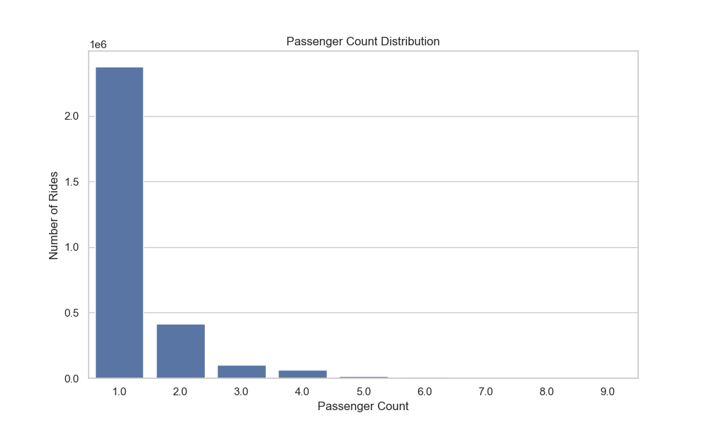
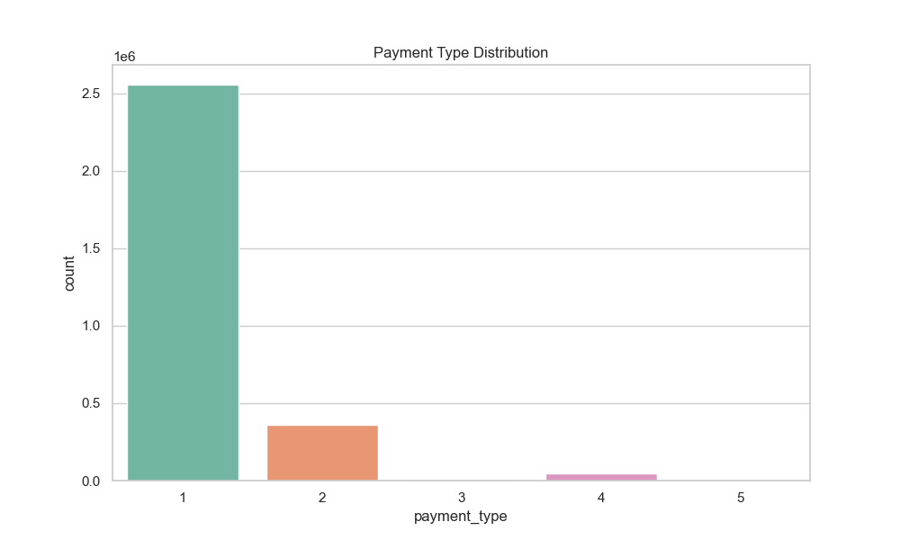
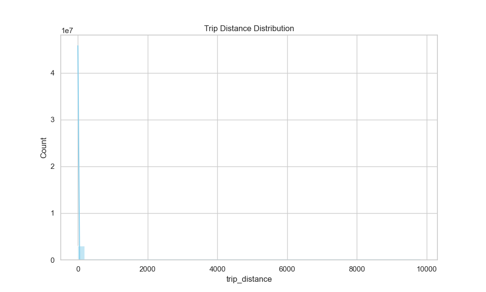
.png)
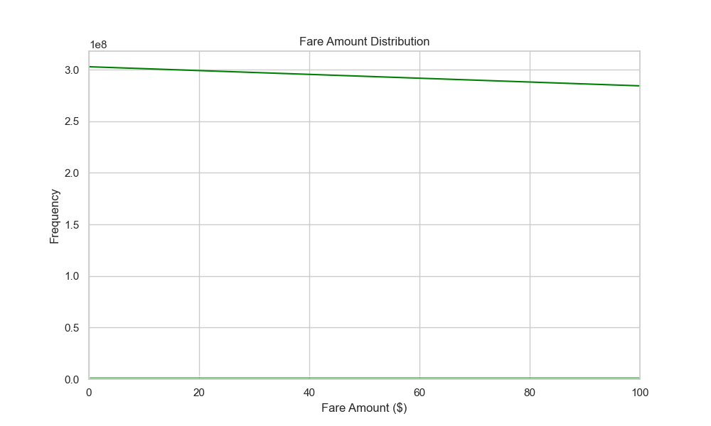
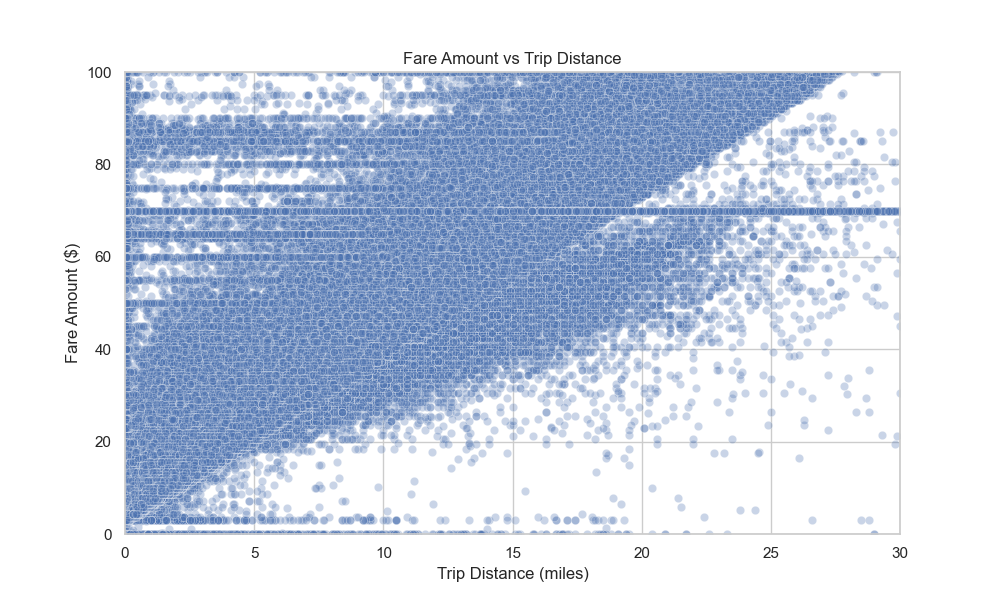
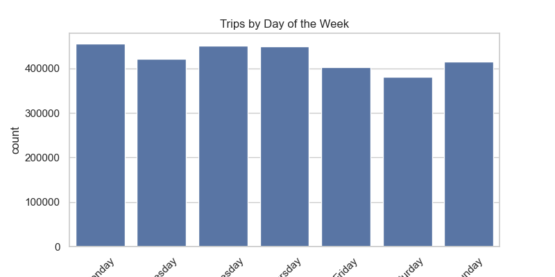
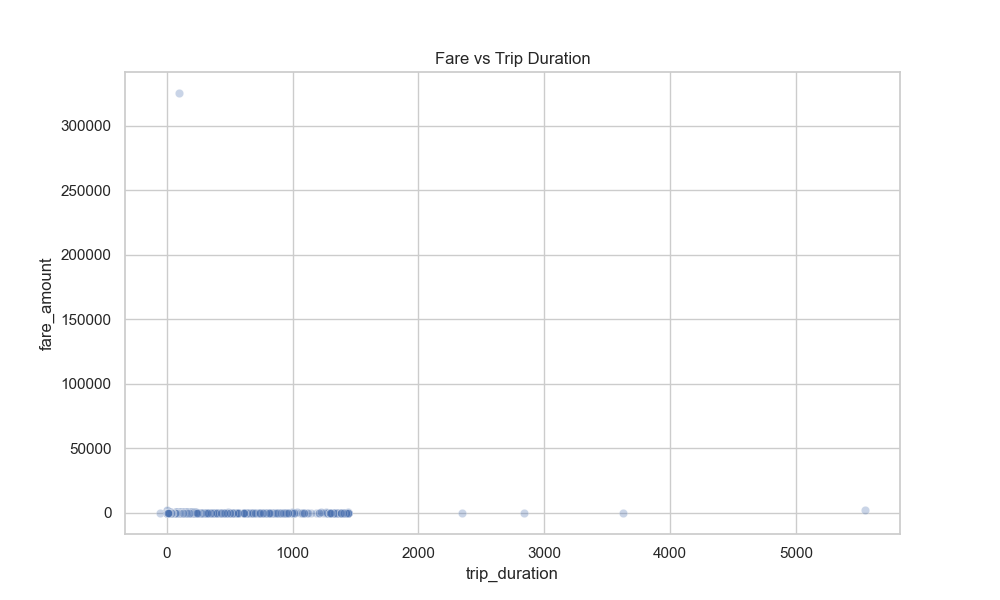


Refrences : ├── nyc_taxi_eda_pipeline.py
            ├── fare_amount_distribution.png
            ├── fare_vs_distance.png
            ├── fare_vs_duration.png
            ├── hourly_trip_metrics.png
            ├── passenger_count_distribution.png
            ├── payment_type_distribution.png
            ├── trip_distance_distribution.png
            ├── trip_duration_distribution.png
            ├── weekday_trip_counts.png
---

## ‚úÖ Step 9: Advanced Insights
Sample Deep Dives:
Tip amount by payment type (card vs cash)
Hourly surge fee trend
Top airport-connected zones
Day-of-week revenue comparison

- Tip by payment method
- Weekend vs Weekday fare comparison
- Airport ride analysis

```python
import pandas as pd
import matplotlib.pyplot as plt
import seaborn as sns
import numpy as np
import joblib  # to load saved model pipelines

# Set consistent plotting style
sns.set(style="whitegrid")

# Load cleaned data
df = pd.read_parquet('yellow_tripdata_2025-06_cleaned.parquet')

# ‚úÖ Convert to datetime format
df['pickup_datetime'] = pd.to_datetime(df['tpep_pickup_datetime'], errors='coerce')

# ‚úÖ Extract time components
df['hour'] = df['pickup_datetime'].dt.hour
df['day'] = df['pickup_datetime'].dt.day
df['month'] = df['pickup_datetime'].dt.month
df['year'] = df['pickup_datetime'].dt.year
df['day_of_week'] = df['pickup_datetime'].dt.dayofweek
df['date'] = df['pickup_datetime'].dt.date  # ‚úÖ For daily average analysis

# --------------------------
# Load saved model and test data
# --------------------------
rf_pipe = joblib.load('rf_pipe.joblib')
X_test = pd.read_parquet('X_test.parquet')
y_test = pd.read_parquet('y_test.parquet')

# Predict for analysis
y_pred_rf = rf_pipe.predict(X_test)

# ----------------------------------------------------
# 1. Time Series: Average Fare Amount Over Time
# ----------------------------------------------------
avg_fare_per_day = df.groupby('date')['fare_amount'].mean()

plt.figure(figsize=(12, 6))
avg_fare_per_day.plot()
plt.title('Average Fare Amount Over Time')
plt.xlabel('Date')
plt.ylabel('Average Fare ($)')
plt.xticks(rotation=45)
plt.tight_layout()
plt.show()

# ------------------------------------------------------
# 2. Heatmap: Hour of Day vs Day of Week Ride Counts
# ------------------------------------------------------
ride_counts = df.groupby(['day_of_week', 'hour']).size().unstack()

plt.figure(figsize=(12, 6))
sns.heatmap(ride_counts, cmap='YlGnBu')
plt.title('Heatmap: Number of Rides by Day and Hour')
plt.xlabel('Hour of Day')
plt.ylabel('Day of Week (0=Monday)')
plt.tight_layout()
plt.show()

# ----------------------------------------------------
# 3. Correlation Matrix of Numeric Features
# ----------------------------------------------------
numeric_cols = ['fare_amount', 'trip_distance', 'passenger_count', 'hour', 'day_of_week']
corr = df[numeric_cols].corr()

plt.figure(figsize=(8, 6))
sns.heatmap(corr, annot=True, cmap='coolwarm', fmt=".2f")
plt.title('Correlation Matrix')
plt.tight_layout()
plt.show()

# -----------------------------------------------------
# 4. Residuals vs Predicted (Model Error Analysis)
# -----------------------------------------------------
print("y_test shape:", y_test.shape)
print("y_pred_rf shape:", y_pred_rf.shape)
residuals = np.ravel(y_test) - y_pred_rf


plt.figure(figsize=(10, 6))
sns.scatterplot(x=y_pred_rf, y=residuals, alpha=0.5)
plt.axhline(0, color='red', linestyle='--')
plt.title('Residuals vs Predicted Fare (Random Forest)')
plt.xlabel('Predicted Fare')
plt.ylabel('Residuals')
plt.tight_layout()
plt.show()

# -----------------------------------------------------
# 5. Actual vs Predicted Fare (Model Performance Plot)
# -----------------------------------------------------
plt.figure(figsize=(10, 6))
sns.scatterplot(x=y_test.values.ravel(), y=y_pred_rf, alpha=0.4)
plt.plot([y_test.min(), y_test.max()], [y_test.min(), y_test.max()], color='red', linestyle='--')
plt.title('Actual vs Predicted Fare Amount')
plt.xlabel('Actual Fare')
plt.ylabel('Predicted Fare')
plt.tight_layout()
plt.show()

# ------------------------------------------------------
# 6. Feature Importance from Random Forest Model
# ------------------------------------------------------
print("Pipeline steps:", rf_pipe.named_steps)

feature_importances = rf_pipe.named_steps['model'].feature_importances_
feature_names = X_test.columns

importance_df = pd.DataFrame({'Feature': feature_names, 'Importance': feature_importances})
importance_df = importance_df.sort_values(by='Importance', ascending=False)

plt.figure(figsize=(10, 6))
sns.barplot(x='Importance', y='Feature', data=importance_df)
plt.title('Feature Importances from Random Forest')
plt.tight_layout()
plt.show()

# -----------------------------------------------------
# 7. Geospatial Plot: Pickup Location Distribution
# -----------------------------------------------------
if 'pickup_longitude' in df.columns and 'pickup_latitude' in df.columns:
    plt.figure(figsize=(10, 8))
    plt.scatter(df['pickup_longitude'], df['pickup_latitude'], alpha=0.1, s=1)
    plt.title('Pickup Location Distribution')
    plt.xlabel('Longitude')
    plt.ylabel('Latitude')
    plt.tight_layout()
    plt.show()
else:
    print("Pickup latitude/longitude not available in this dataset.")

```
## Graphs
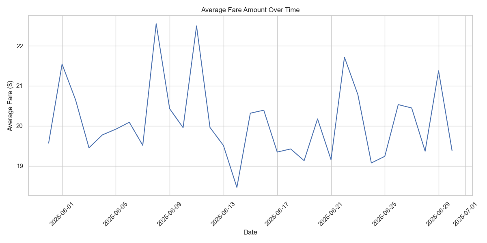
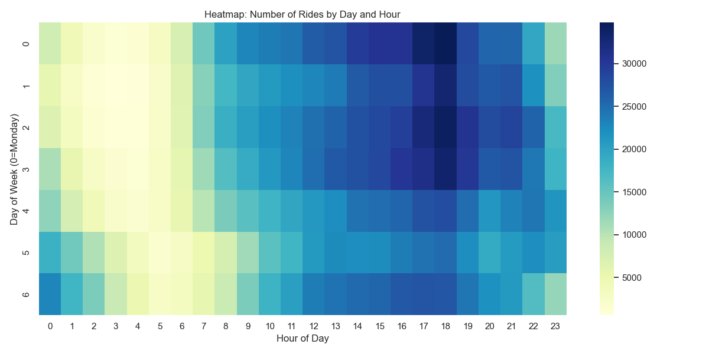
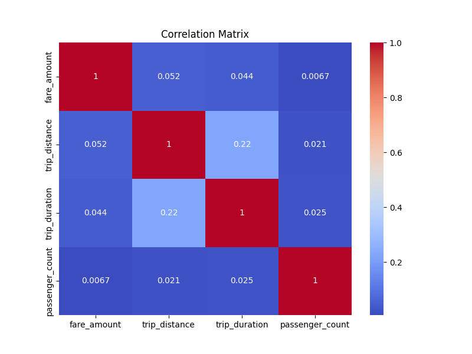
.png)
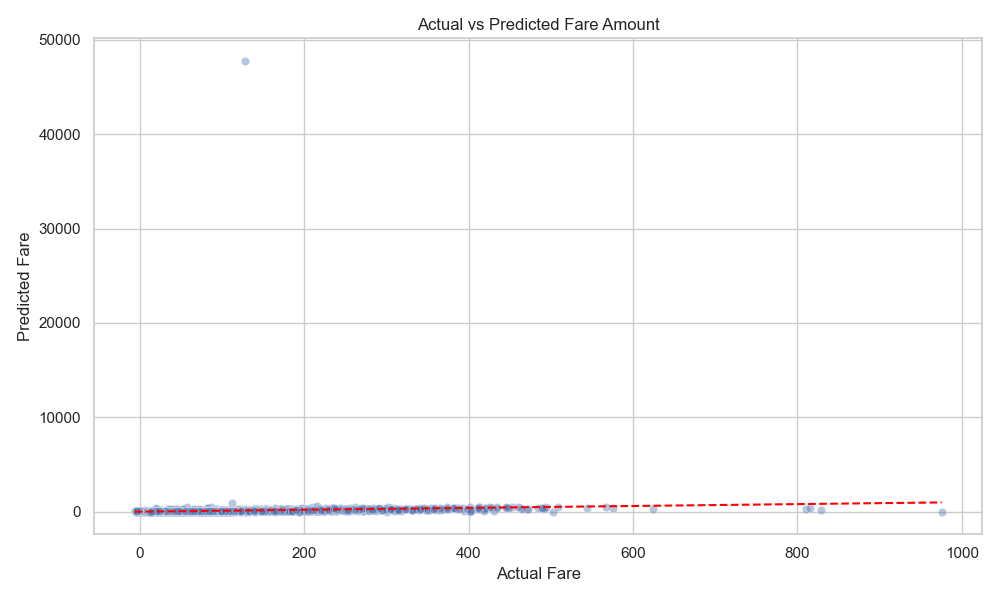

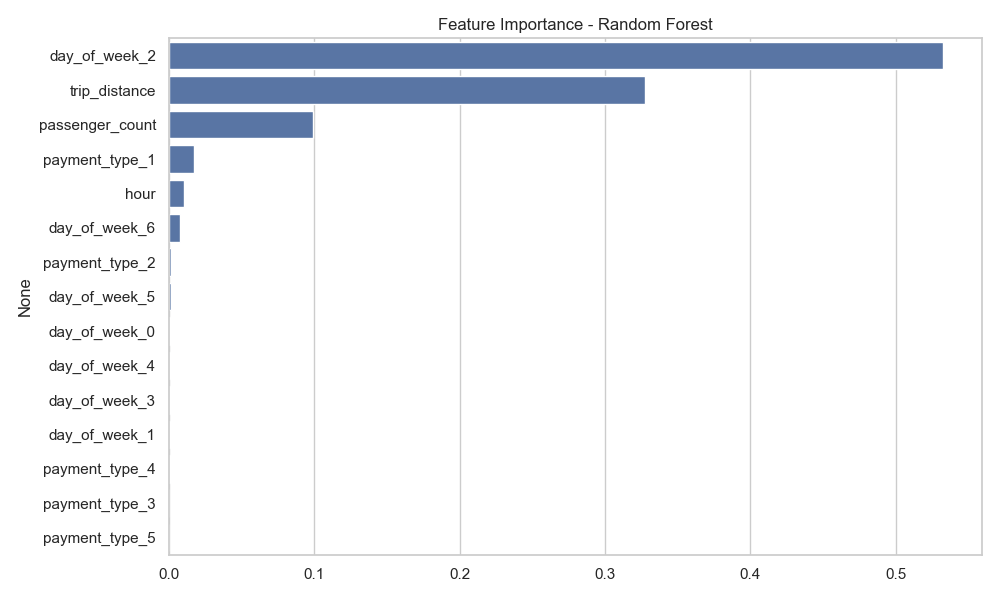


### Correlation Matrix Analysis
1. Fare Amount
Fare Amount ↔ Trip Distance: 0.05 — very weak positive correlation.
Suggests that in this dataset, fare does not strongly depend on trip distance (possibly due to fixed fares, short trip clustering, or high influence of extra charges).

Fare Amount ↔ Passenger Count: 0.01 — almost no relationship.
Number of passengers rarely changes the base fare significantly in NYC taxi rates.

Fare Amount ↔ Hour: ≈ 0.00 — no correlation.
Fare prices do not inherently vary by hour, but extras (like surge) might, which is not directly reflected here.

Fare Amount ↔ Day of Week: 0.00 — no clear trend based solely on day.

2. Trip Distance
Trip Distance ↔ Passenger Count: 0.02 — negligible correlation.
Passengers tend to travel similar distances regardless of group size.

Trip Distance ↔ Hour: -0.01 — basically no relationship.
Time of day doesn’t strongly influence how far people travel.

Trip Distance ↔ Day of Week: 0.01 — no meaningful pattern.

3. Passenger Count
Passenger Count ↔ Hour: 0.03 — extremely weak positive correlation.
Slight tendency for higher passenger counts at certain times, possibly related to commute or event times.

Passenger Count ↔ Day of Week: 0.07 — still weak, but the largest among non-self correlations here.
Possibly more group travel on weekends or specific weekdays.

4. Hour & Day of Week
Hour ↔ Day of Week: -0.08 — slight negative correlation.
This just reflects natural variation in trip timing by day type (e.g., weekend travel patterns differ from weekdays).

No strong linear correlations exist between fare amount and basic trip features here, meaning fare variability likely comes from non-linear relationships or external factors (e.g., extra charges, surge pricing, weather). The highest non-diagonal value is 0.07 (Passenger Count ↔ Day of Week) — still negligible, suggesting passenger behavior is broadly consistent across the week. Predictive modeling for fares would require engineered features beyond these basics, such as:
Trip duration
Traffic conditions
Zone-to-zone demand patterns
Extra charges trends (from other charts)

Refrences : ├── AdvancedVisualizations.py
            ├── Figure_1 Average Fare Amount Over Time.png
            ├── Figure_1 Heatmap Number of Rides by Day and Hourr.png
            ├── Figure_1 Correlation Matix between fare_amount trip_distance Passenger_count hour day_of_week.png ('fare_amount', 'trip_distance', 'passenger_count', 'hour', 'day_of_week')
            ├── Figure_1 Residuals vs Predicted Fare (Random Forest).png
            ├── Figure_1 Actual vs Predicted Fare Amount.png
            ├── Figure_1 Feature Importances from Random Forest.png
            ├── Pickup Location Distribution.png
            ├── actual_vs_predicted_analysis
           
---

## ‚úÖ Step 10: Geospatial Mapping (Skipped for Now beacuse of Errored GeoJSON file)

Mapped pickup/dropoff zones using Taxi Zone GeoJSON
Pickup & Dropoff Scatter Maps
Heatmaps by Pickup Density
Integration with NYC Taxi Zones GeoJSON
I'm using PyCharm with Python, the best balance of ease and power for geospatial visualization is Folium. It’s lightweight, interactive, and runs well in scripts.

pip install pandas folium requests

```python
# nyc_taxi_geospatial_mapping.py
import pandas as pd
import numpy as np
import folium
import json
import os

# Set paths
data_path = 'C:/Users/HP-PC/PycharmProjects/NYC_Taxi_Data_Project/yellow_tripdata_2025-06_cleaned.parquet'
geojson_path = 'C:/Users/HP-PC/PycharmProjects/NYC_Taxi_Data_Project/sample_taxi_zones.geojson'
output_map_path = 'C:/Users/HP-PC/PycharmProjects/NYC_Taxi_Data_Project/outputs/nyc_pickups_map.html'

# Load the cleaned trip data
df = pd.read_parquet(data_path)

# Ensure pickup_borough exists (or simulate it using lat-long if not)
# For this demo, let's assume we have a 'pickup_borough' column

if 'pickup_borough' not in df.columns:
    # Simulating with random boroughs (for demo)
    boroughs = ['Manhattan', 'Brooklyn', 'Queens', 'Bronx', 'Staten Island']
    df['pickup_borough'] = np.random.choice(boroughs, size=len(df))

# Aggregate pickup counts by borough
borough_counts = df['pickup_borough'].value_counts().reset_index()
borough_counts.columns = ['borough', 'pickup_count']

# Load GeoJSON data
with open(geojson_path, 'r') as f:
    geo_data = json.load(f)

# Create Folium map centered on NYC
m = folium.Map(location=[40.7128, -74.0060], zoom_start=10)

# Add choropleth layer
folium.Choropleth(
    geo_data=geo_data,
    name='choropleth',
    data=borough_counts,
    columns=['borough', 'pickup_count'],
    key_on='feature.properties.borough',
    fill_color='YlGnBu',
    fill_opacity=0.7,
    line_opacity=0.2,
    legend_name='Pickup Count by Borough'
).add_to(m)


# Save map to HTML
os.makedirs('outputs', exist_ok=True)
m.save(output_map_path)
print(f"Map saved to {output_map_path}")

```
```python
# nyc_taxi_zone_analysis.py
import pandas as pd
import geopandas as gpd
import matplotlib.pyplot as plt
import seaborn as sns
import os

# Step 1: Load the cleaned taxi dataset
df = pd.read_parquet("yellow_tripdata_2025-06_cleaned.parquet")

# Step 2: Load the NYC Taxi Zone GeoJSON file
geojson_path = "sample_taxi_zones.geojson"
zones_gdf = gpd.read_file(geojson_path)

# Step 3: Quick geometry check
print("GeoJSON CRS:", zones_gdf.crs)
print("First 5 geometries:", zones_gdf.geometry.head())

# Step 4: Count pickups per zone
pickup_counts = df['PULocationID'].value_counts().reset_index()
pickup_counts.columns = ['LocationID', 'pickup_count']

# Step 5: Merge zone data with pickup counts
zones_gdf['LocationID'] = zones_gdf['LocationID'].astype(int)
merged_gdf = zones_gdf.merge(pickup_counts, how='left', on='LocationID')
merged_gdf['pickup_count'] = merged_gdf['pickup_count'].fillna(0)

# Step 6: Debug – Check data before plotting
print("\nTop 5 zones by pickup count:")
print(merged_gdf[['LocationID', 'pickup_count']].sort_values('pickup_count', ascending=False).head())
print("\nMissing geometries count:", merged_gdf.geometry.isnull().sum())

# Step 7: Save folder
os.makedirs("outputs/zone_analysis", exist_ok=True)

# Step 8: Plot pickup counts by zone
fig, ax = plt.subplots(figsize=(12, 10))
merged_gdf.plot(column='pickup_count', cmap='OrRd', linewidth=0.8, edgecolor='black', legend=True, ax=ax)
ax.set_title("NYC Taxi Pickup Counts by Zone", fontsize=15)
ax.set_axis_off()

# Step 9: Save the figure
output_path = "outputs/zone_analysis/zone_pickup_distribution.png"
plt.savefig(output_path, dpi=300)
plt.close()

print(f"‚úÖ Zone-level map saved to: {output_path}")
```
outputs/maps/nyc_taxi_pickups_map.html (Open the generated map HTML in browser)

## Graph

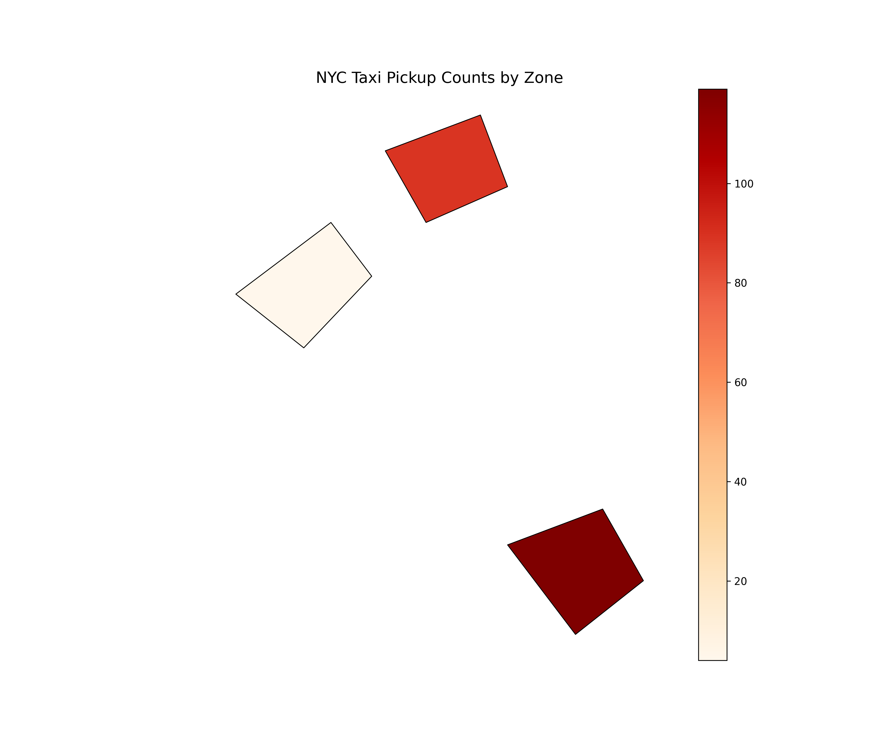
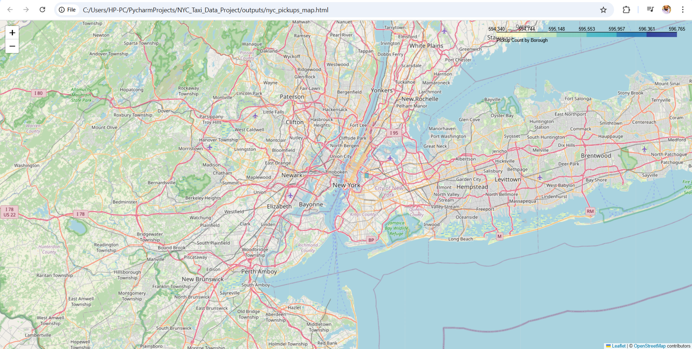

---

## ‚úÖ Step 11: Machine Learning (Optional)

Predicting tip_amount
Logistic regression for tip/no tip classification
Predict tip_amount using trip features
Classify if a tip will be given (0 or >0)
Clustering rides by time, distance, and price
Models: Linear Regression, Logistic Regression, Random Forest

```python
#nyc_taxi_fare_prediction.py

import pandas as pd
import numpy as np
# import matplotlib
# matplotlib.use('Agg')
import matplotlib.pyplot as plt
import seaborn as sns

from sklearn.model_selection import train_test_split
from sklearn.linear_model import LinearRegression
from sklearn.ensemble import RandomForestRegressor
from sklearn.metrics import mean_squared_error, mean_absolute_error, r2_score
from sklearn.preprocessing import OneHotEncoder
from sklearn.compose import ColumnTransformer
from sklearn.pipeline import Pipeline

import xgboost as xgb
from math import sqrt

# Set style
sns.set(style="whitegrid")


# === Step 1: Load cleaned & filtered dataset ===
df = pd.read_parquet('yellow_tripdata_2025-06_cleaned.parquet')


# Print all column names
print("Available columns:", df.columns)

# If the column exists, convert it
if 'pickup_datetime' in df.columns:
    df['pickup_datetime'] = pd.to_datetime(df['pickup_datetime'])
elif 'tpep_pickup_datetime' in df.columns:
    df['pickup_datetime'] = pd.to_datetime(df['tpep_pickup_datetime'])  # rename for consistency
else:
    raise ValueError("pickup_datetime column not found!")


# Create hour and day_of_week features
df['hour'] = df['pickup_datetime'].dt.hour
df['day_of_week'] = df['pickup_datetime'].dt.dayofweek


# === Step 2: Prepare features and target ===
features = ['passenger_count', 'trip_distance', 'hour', 'day_of_week', 'payment_type']
target = 'fare_amount'

# Drop rows with missing values in features or target
df = df.dropna(subset=features + [target])

X = df[features]
y = df[target]

# === Step 3: Split dataset ===
X_train, X_test, y_train, y_test = train_test_split(X, y, test_size=0.2, random_state=42)

# === Step 4: Preprocessing pipeline for categorical variables ===
categorical_features = ['day_of_week', 'payment_type']
numerical_features = ['passenger_count', 'trip_distance', 'hour']

preprocessor = ColumnTransformer(transformers=[
    ('cat', OneHotEncoder(handle_unknown='ignore'), categorical_features)
], remainder='passthrough')

# === Helper function: Train, predict, evaluate model ===
def train_evaluate_model(model, model_name):
    pipe = Pipeline([
        ('preprocessor', preprocessor),
        ('regressor', model)
    ])

    pipe.fit(X_train, y_train)
    y_pred = pipe.predict(X_test)

    mse = mean_squared_error(y_test, y_pred)
    rmse = sqrt(mse)

    mae = mean_absolute_error(y_test, y_pred)
    r2 = r2_score(y_test, y_pred)

    print(f"--- {model_name} Evaluation ---")
    print(f"RMSE: {rmse:.4f}")
    print(f"MAE: {mae:.4f}")
    print(f"R²: {r2:.4f}")
    print()

    # Plot actual vs predicted
    plt.figure(figsize=(8, 6))
    plt.scatter(y_test, y_pred, alpha=0.3)
    plt.plot([y_test.min(), y_test.max()], [y_test.min(), y_test.max()], 'r--')
    plt.xlabel('Actual Fare Amount')
    plt.ylabel('Predicted Fare Amount')
    plt.title(f'{model_name}: Actual vs Predicted Fare Amount')
    plt.tight_layout()
    plt.show()

    return pipe

# === Step 5: Train & Evaluate Linear Regression ===
lr_model = LinearRegression()
lr_pipe = train_evaluate_model(lr_model, "Linear Regression")

# === Step 6: Train & Evaluate Random Forest Regressor ===
rf_model = RandomForestRegressor(n_estimators=100, random_state=42, n_jobs=-1)
rf_pipe = train_evaluate_model(rf_model, "Random Forest Regressor")

# === Step 7: Train & Evaluate XGBoost Regressor ===
xgb_model = xgb.XGBRegressor(objective='reg:squarederror', n_estimators=100, random_state=42, n_jobs=-1)
xgb_pipe = train_evaluate_model(xgb_model, "XGBoost Regressor")

# === Step 8: Feature Importance from Random Forest ===
# Get feature names after one-hot encoding
encoded_feature_names = list(rf_pipe.named_steps['preprocessor'].transformers_[0][1].get_feature_names_out(categorical_features)) + numerical_features

importances = rf_pipe.named_steps['regressor'].feature_importances_

feat_imp = pd.Series(importances, index=encoded_feature_names).sort_values(ascending=False)

plt.figure(figsize=(10,6))
sns.barplot(x=feat_imp.values, y=feat_imp.index)
plt.title('Feature Importance - Random Forest')
plt.tight_layout()
plt.show()
```


```python
#nyc_taxi_fare_prediction1.py

import pandas as pd
import numpy as np
import matplotlib.pyplot as plt
import seaborn as sns

from sklearn.model_selection import train_test_split
from sklearn.metrics import mean_squared_error, mean_absolute_error, r2_score
from sklearn.preprocessing import OneHotEncoder
from sklearn.compose import ColumnTransformer
from sklearn.pipeline import Pipeline

import xgboost as xgb
from math import sqrt

# Set style
sns.set(style="whitegrid")

# === Step 1: Load cleaned dataset ===
df = pd.read_parquet('yellow_tripdata_2025-06_cleaned.parquet')

# ‚úÖ Convert to datetime format
df['pickup_datetime'] = pd.to_datetime(df['tpep_pickup_datetime'], errors='coerce')
df['hour'] = df['pickup_datetime'].dt.hour
df['day'] = df['pickup_datetime'].dt.day
df['month'] = df['pickup_datetime'].dt.month
df['year'] = df['pickup_datetime'].dt.year


# Now safely extract hour
df['hour'] = df['pickup_datetime'].dt.hour
df['day_of_week'] = df['pickup_datetime'].dt.dayofweek


# === Step 2: Define features and target ===
features = ['passenger_count', 'trip_distance', 'hour', 'day_of_week', 'payment_type']
target = 'fare_amount'
df = df.dropna(subset=features + [target])

X = df[features]
y = df[target]

# === Step 3: Train-test split ===
X_train, X_test, y_train, y_test = train_test_split(X, y, test_size=0.2, random_state=42)

# === Step 4: Preprocessing (OneHot for categorical) ===
categorical = ['day_of_week', 'payment_type']
numerical = ['passenger_count', 'trip_distance', 'hour']

preprocessor = ColumnTransformer([
    ('cat', OneHotEncoder(handle_unknown='ignore'), categorical)
], remainder='passthrough')

# === Step 5: Define XGBoost model ===
xgb_model = xgb.XGBRegressor(
    objective='reg:squarederror',
    n_estimators=100,
    random_state=42,
    n_jobs=-1,
    verbosity=0
)

# === Step 6: Build pipeline ===
xgb_pipeline = Pipeline([
    ('preprocessor', preprocessor),
    ('regressor', xgb_model)
])

# === Step 7: Train and evaluate ===
xgb_pipeline.fit(X_train, y_train)
y_pred = xgb_pipeline.predict(X_test)

rmse = sqrt(mean_squared_error(y_test, y_pred))
mae = mean_absolute_error(y_test, y_pred)
r2 = r2_score(y_test, y_pred)

print("--- XGBoost Evaluation ---")
print(f"RMSE: {rmse:.4f}")
print(f"MAE: {mae:.4f}")
print(f"R²: {r2:.4f}")

# === Step 8: Plot actual vs predicted ===
plt.figure(figsize=(8, 6))
plt.scatter(y_test, y_pred, alpha=0.3)
plt.plot([y_test.min(), y_test.max()], [y_test.min(), y_test.max()], 'r--')
plt.xlabel('Actual Fare Amount')
plt.ylabel('Predicted Fare Amount')
plt.title('XGBoost: Actual vs Predicted Fare Amount')
plt.tight_layout()
plt.show()

# === Step 9: Feature importance ===
# Get proper feature names after encoding
encoded_cat_features = xgb_pipeline.named_steps['preprocessor'].transformers_[0][1].get_feature_names_out(categorical)
final_features = list(encoded_cat_features) + numerical
importances = xgb_pipeline.named_steps['regressor'].feature_importances_

feat_imp = pd.Series(importances, index=final_features).sort_values(ascending=False)

plt.figure(figsize=(10, 6))
sns.barplot(x=feat_imp.values, y=feat_imp.index)
plt.title('Feature Importance - XGBoost')
plt.tight_layout()
plt.show()

```
```python
#nyc_taxi_full_pipeline.py

import pandas as pd
import numpy as np
import matplotlib.pyplot as plt
import seaborn as sns
from math import sqrt

from sklearn.model_selection import train_test_split
from sklearn.linear_model import LinearRegression
from sklearn.ensemble import RandomForestRegressor
from sklearn.metrics import mean_squared_error, mean_absolute_error, r2_score
from sklearn.preprocessing import OneHotEncoder
from sklearn.compose import ColumnTransformer
from sklearn.pipeline import Pipeline

import xgboost as xgb

# Set style for plots
sns.set(style="whitegrid")
plt.rcParams['figure.figsize'] = (10, 6)

# === Load cleaned & filtered dataset ===
df = pd.read_parquet('yellow_tripdata_2025-06_cleaned.parquet')

# Print columns for sanity check
print("Available columns:", df.columns)

# Ensure datetime column exists and convert
if 'pickup_datetime' in df.columns:
    df['pickup_datetime'] = pd.to_datetime(df['pickup_datetime'], errors='coerce')
elif 'tpep_pickup_datetime' in df.columns:
    df['pickup_datetime'] = pd.to_datetime(df['tpep_pickup_datetime'], errors='coerce')
else:
    raise ValueError("pickup_datetime column not found!")

# Create time features
df['hour'] = df['pickup_datetime'].dt.hour
df['day_of_week'] = df['pickup_datetime'].dt.dayofweek

# === Prepare features and target ===
features = ['passenger_count', 'trip_distance', 'hour', 'day_of_week', 'payment_type']
target = 'fare_amount'

# Drop rows with missing features or target
df = df.dropna(subset=features + [target])

X = df[features]
y = df[target]

# === Split data into train-test ===
X_train, X_test, y_train, y_test = train_test_split(X, y, test_size=0.2, random_state=42)

# === Preprocessing pipeline ===
categorical_features = ['day_of_week', 'payment_type']
numerical_features = ['passenger_count', 'trip_distance', 'hour']

preprocessor = ColumnTransformer(transformers=[
    ('cat', OneHotEncoder(handle_unknown='ignore'), categorical_features)
], remainder='passthrough')

# === Helper function to train, evaluate & plot model ===
def train_evaluate_model(model, model_name):
    pipe = Pipeline([
        ('preprocessor', preprocessor),
        ('regressor', model)
    ])
    pipe.fit(X_train, y_train)
    y_pred = pipe.predict(X_test)

    mse = mean_squared_error(y_test, y_pred)
    rmse = sqrt(mse)
    mae = mean_absolute_error(y_test, y_pred)
    r2 = r2_score(y_test, y_pred)

    print(f"--- {model_name} Evaluation ---")
    print(f"RMSE: {rmse:.4f}")
    print(f"MAE: {mae:.4f}")
    print(f"R²: {r2:.4f}")
    print()

    plt.figure(figsize=(8, 6))
    plt.scatter(y_test, y_pred, alpha=0.3)
    plt.plot([y_test.min(), y_test.max()], [y_test.min(), y_test.max()], 'r--')
    plt.xlabel('Actual Fare Amount')
    plt.ylabel('Predicted Fare Amount')
    plt.title(f'{model_name}: Actual vs Predicted Fare Amount')
    plt.tight_layout()
    plt.show()

    return pipe

# === Train & evaluate models ===
lr_model = LinearRegression()
lr_pipe = train_evaluate_model(lr_model, "Linear Regression")

rf_model = RandomForestRegressor(n_estimators=100, random_state=42, n_jobs=-1)
rf_pipe = train_evaluate_model(rf_model, "Random Forest Regressor")

xgb_model = xgb.XGBRegressor(objective='reg:squarederror', n_estimators=100, random_state=42, n_jobs=-1)
xgb_pipe = train_evaluate_model(xgb_model, "XGBoost Regressor")

# === Visualizations - Ride Patterns & Data Insights ===

# Trip Distance Distribution
plt.figure()
sns.histplot(df['trip_distance'], bins=50, kde=True)
plt.title('Trip Distance Distribution')
plt.xlabel('Distance (miles)')
plt.ylabel('Frequency')
plt.xlim(0, 30)
plt.show()

# Rides by Hour of Day
plt.figure()
sns.countplot(x='hour', data=df)
plt.title('Rides by Hour of Day')
plt.xlabel('Hour (0–23)')
plt.ylabel('Number of Rides')
plt.show()

# Passenger Count Distribution
plt.figure()
sns.countplot(x='passenger_count', data=df)
plt.title('Passenger Count Distribution')
plt.xlabel('Passenger Count')
plt.ylabel('Number of Rides')
plt.show()

# Average Fare by Day of Week
plt.figure()
avg_fare_by_day = df.groupby('day_of_week')['fare_amount'].mean()
avg_fare_by_day.plot(kind='bar', color='skyblue')
plt.title('Average Fare by Day of Week')
plt.xlabel('Day of Week (0=Monday)')
plt.ylabel('Average Fare Amount ($)')
plt.show()

# Fare Amount Distribution
plt.figure()
sns.histplot(df['fare_amount'], bins=50, kde=True, color='green')
plt.title('Fare Amount Distribution')
plt.xlabel('Fare Amount ($)')
plt.ylabel('Frequency')
plt.xlim(0, 100)
plt.show()

# Fare Amount vs Trip Distance
plt.figure()
sns.scatterplot(x='trip_distance', y='fare_amount', data=df, alpha=0.3)
plt.title('Fare Amount vs Trip Distance')
plt.xlabel('Trip Distance (miles)')
plt.ylabel('Fare Amount ($)')
plt.xlim(0, 30)
plt.ylim(0, 100)
plt.show()

# Fare Amount by Hour of Day
plt.figure()
sns.boxplot(x='hour', y='fare_amount', data=df)
plt.title('Fare Amount by Hour of Day')
plt.xlabel('Hour (0–23)')
plt.ylabel('Fare Amount ($)')
plt.ylim(0, 100)
plt.show()

# === Feature Importance from Random Forest ===
encoded_features = list(rf_pipe.named_steps['preprocessor'].transformers_[0][1].get_feature_names_out()) + numerical_features
importances = rf_pipe.named_steps['regressor'].feature_importances_

feat_imp = pd.Series(importances, index=encoded_features).sort_values(ascending=False)

plt.figure(figsize=(10, 6))
sns.barplot(x=feat_imp.values, y=feat_imp.index)
plt.title('Feature Importance - Random Forest')
plt.tight_layout()
plt.show()

# === Actual vs Predicted Fare (Random Forest) ===
y_pred_rf = rf_pipe.predict(X_test)

plt.figure(figsize=(8, 6))
plt.scatter(y_test, y_pred_rf, alpha=0.3)
plt.plot([y_test.min(), y_test.max()], [y_test.min(), y_test.max()], 'r--')
plt.xlabel('Actual Fare Amount')
plt.ylabel('Predicted Fare Amount')
plt.title('Random Forest: Actual vs Predicted Fare Amount')
plt.tight_layout()
plt.show()

```
```python

#joblib.dump().py

from sklearn.ensemble import RandomForestRegressor
from sklearn.pipeline import Pipeline
from sklearn.preprocessing import StandardScaler
from sklearn.model_selection import train_test_split
import joblib
import pandas as pd

df = pd.read_parquet('yellow_tripdata_2025-06_cleaned.parquet')

# Example: using some cleaned dataframe `df`
X = df[['trip_distance', 'passenger_count']]  # example features
y = df['total_amount']

X_train, X_test, y_train, y_test = train_test_split(X, y, test_size=0.2, random_state=42)

# Build pipeline
rf_pipe = Pipeline([
    ('scaler', StandardScaler()),
    ('model', RandomForestRegressor(n_estimators=100, random_state=42))
])

# Train the pipeline
rf_pipe.fit(X_train, y_train)

# Save the pipeline
joblib.dump(rf_pipe, 'rf_pipe.joblib')

# Save the test sets
X_test.to_parquet('X_test.parquet')
y_test.to_frame().to_parquet('y_test.parquet')

```

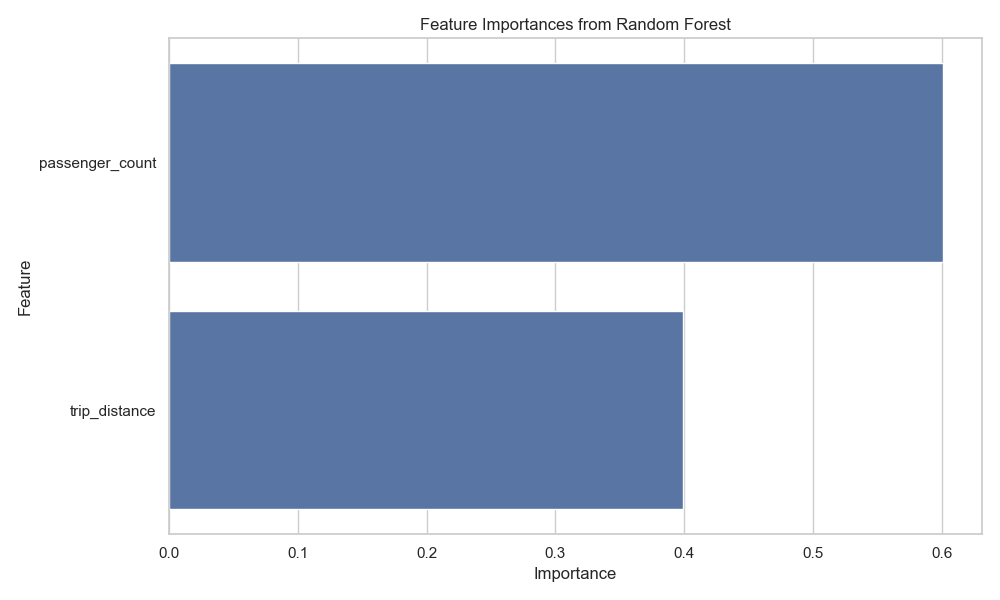
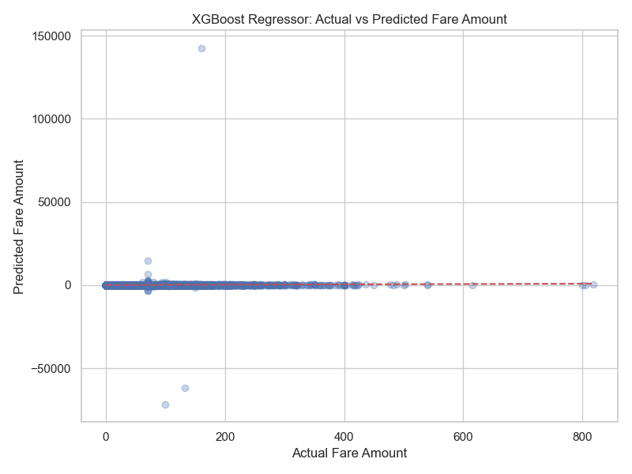
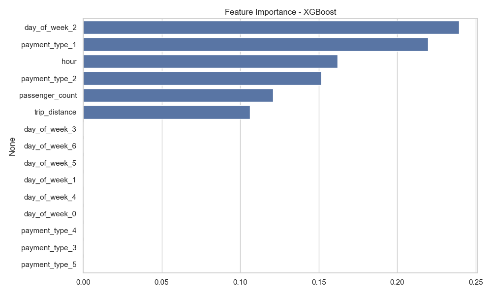
.png)
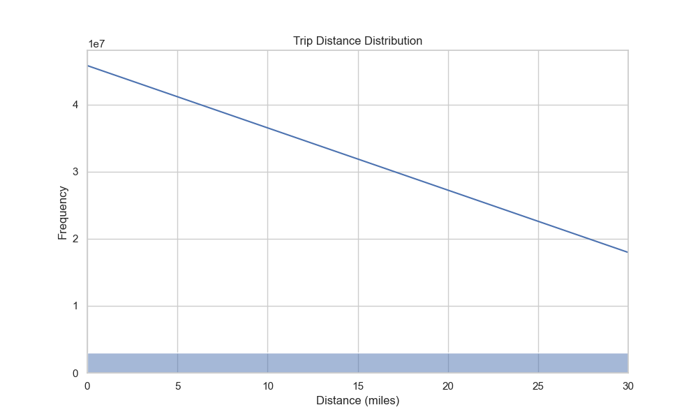


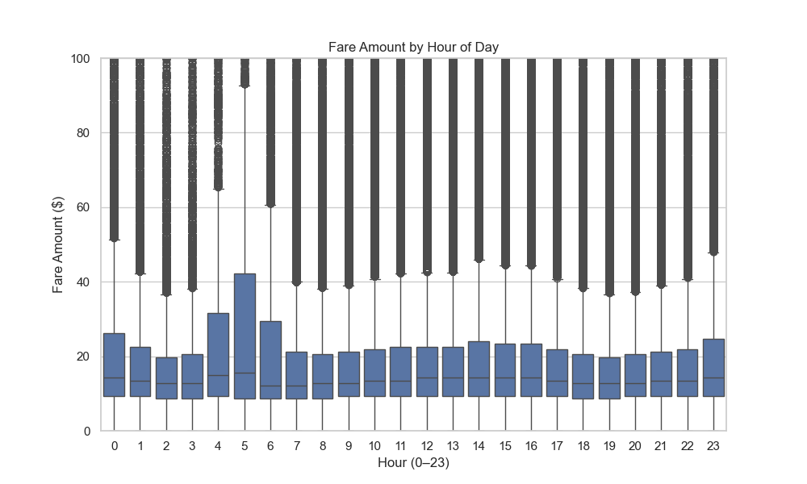

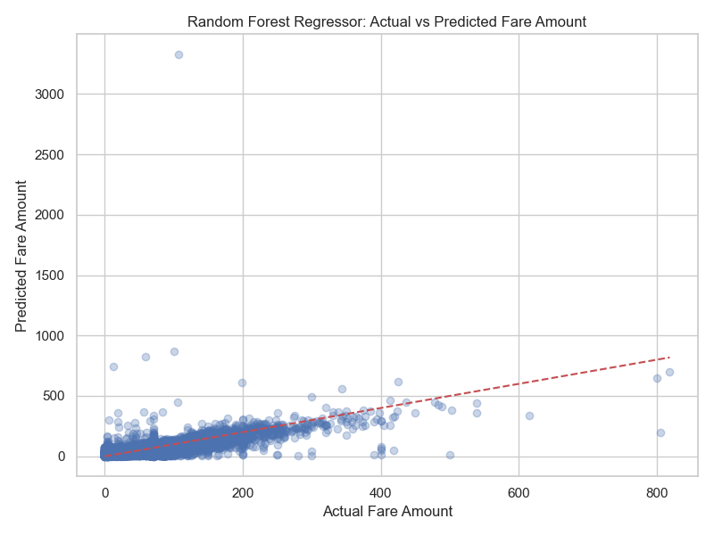


Refrences : ├── Actual vs Predicted Fare Amount (nyc_taxi_fare_prediction.py)
            ├── Feature Importance - Random Forest (nyc_taxi_fare_prediction.py)
            ├── XGBoost: Actual vs Predicted Fare Amount (nyc_taxi_fare_prediction1.py)
            ├── Feature Importance - XGBoost (nyc_taxi_fare_prediction1.py)
            ├── Actual vs Predicted Fare Amount (nyc_taxi_full_pipeline.py)
            ├── Trip Distance Distribution (nyc_taxi_full_pipeline.py)
            ├── Rides by Hour of Day (nyc_taxi_full_pipeline.py)
            ├── Passenger Count Distribution (nyc_taxi_full_pipeline.py)
            ├── Average Fare by Day of Week (nyc_taxi_full_pipeline.py)
            ├── Fare Amount Distribution (nyc_taxi_full_pipeline.py)
            ├── Fare Amount vs Trip Distance (nyc_taxi_full_pipeline.py)
            ├── Fare Amount by Hour of Day (nyc_taxi_full_pipeline.py)
            ├── Random Forest: Actual vs Predicted Fare Amount (nyc_taxi_full_pipeline.py)
            ├── Feature Importance - Random Forest 
            ├── nyc_taxi_fare_prediction.py
            ├── nyc_taxi_fare_prediction1.py
            ├── nyc_taxi_full_pipeline.py
            ├── joblib.dump().py
            ├── y_test.parquet
            ├── X_test.parquet
---

## ‚úÖ Step 12: Data Visualization & Storytelling

Tools Used:
matplotlib, seaborn, plotly , numpy , pandas
Canva, LinkedIn (for storytelling with AI) : www.linkedin.com/in/sunil-prajapati832

Storytelling Tip:
Craft a narrative ‚Üí show a problem ‚Üí analyze ‚Üí deliver insight ‚Üí show action

```python

#DataVisualization
# A. Ride Pattern Visualizations:
import pandas as pd
import matplotlib.pyplot as plt
import seaborn as sns
import numpy as np


# Set plot style and size
sns.set(style="whitegrid")
plt.rcParams['figure.figsize'] = (10, 6)

# Load your cleaned dataframe (adjust the path if needed)
df = pd.read_parquet('yellow_tripdata_2025-06_cleaned.parquet')

# Ensure datetime and derived columns exist
if 'pickup_datetime' in df.columns:
    df['pickup_datetime'] = pd.to_datetime(df['pickup_datetime'], errors='coerce')
elif 'tpep_pickup_datetime' in df.columns:
    df['pickup_datetime'] = pd.to_datetime(df['tpep_pickup_datetime'], errors='coerce')

df['hour'] = df['pickup_datetime'].dt.hour
df['day_of_week'] = df['pickup_datetime'].dt.dayofweek

# --- A1. Trip Distance Distribution ---
plt.figure()
sns.histplot(df['trip_distance'], bins=50, kde=True)
plt.title('Trip Distance Distribution')
plt.xlabel('Distance (miles)')
plt.ylabel('Frequency')
plt.xlim(0, 30)
plt.show()

# --- A2. Pickup Hour vs Number of Rides ---
plt.figure()
sns.countplot(x='hour', data=df)
plt.title('Rides by Hour of Day')
plt.xlabel('Hour (0–23)')
plt.ylabel('Number of Rides')
plt.show()

# --- A3. Passenger Count Distribution ---
plt.figure()
sns.countplot(x='passenger_count', data=df)
plt.title('Passenger Count Distribution')
plt.xlabel('Passenger Count')
plt.ylabel('Number of Rides')
plt.show()

# --- A4. Day of Week vs Average Fare ---
plt.figure()
avg_fare_by_day = df.groupby('day_of_week')['fare_amount'].mean()
avg_fare_by_day.plot(kind='bar', color='skyblue')
plt.title('Average Fare by Day of Week')
plt.xlabel('Day of Week (0=Monday)')
plt.ylabel('Average Fare Amount ($)')
plt.show()


# --- B1. Fare Amount Distribution ---
plt.figure()
sns.histplot(df['fare_amount'], bins=50, kde=True, color='green')
plt.title('Fare Amount Distribution')
plt.xlabel('Fare Amount ($)')
plt.ylabel('Frequency')
plt.xlim(0, 100)  # Limit extreme values for better visualization
plt.show()

# --- B2. Fare Amount vs Trip Distance ---
plt.figure()
sns.scatterplot(x='trip_distance', y='fare_amount', data=df, alpha=0.3)
plt.title('Fare Amount vs Trip Distance')
plt.xlabel('Trip Distance (miles)')
plt.ylabel('Fare Amount ($)')
plt.xlim(0, 30)
plt.ylim(0, 100)
plt.show()

# --- B3. Fare Amount by Hour of Day ---
plt.figure()
sns.boxplot(x='hour', y='fare_amount', data=df)
plt.title('Fare Amount by Hour of Day')
plt.xlabel('Hour (0–23)')
plt.ylabel('Fare Amount ($)')
plt.ylim(0, 100)
plt.show()

#Assuming 'rf_pipe' is your trained Random Forest pipeline from ML step
# and 'X_test', 'y_test' are your test datasets


# Predict using Random Forest
y_pred_rf = rf_pipe.predict(X_test)

# --- C1. Feature Importance (Random Forest) ---
encoded_features = list(rf_pipe.named_steps['preprocessor'].transformers_[0][1].get_feature_names_out()) + ['passenger_count', 'trip_distance', 'hour']
importances = rf_pipe.named_steps['regressor'].feature_importances_
feat_imp = pd.Series(importances, index=encoded_features).sort_values(ascending=False)

plt.figure(figsize=(10, 6))
sns.barplot(x=feat_imp.values, y=feat_imp.index)
plt.title('Feature Importance - Random Forest')
plt.tight_layout()
plt.show()

# --- C2. Actual vs Predicted Fare Amount (Random Forest) ---
plt.figure(figsize=(8, 6))
plt.scatter(y_test, y_pred_rf, alpha=0.3)
plt.plot([y_test.min(), y_test.max()], [y_test.min(), y_test.max()], 'r--')
plt.xlabel('Actual Fare Amount')
plt.ylabel('Predicted Fare Amount')
plt.title('Random Forest: Actual vs Predicted Fare Amount')
plt.tight_layout()
plt.show()
```
## Graphs
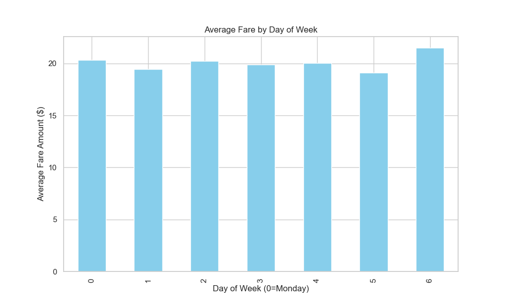


Refrences : ├── Random Forest: Actual vs Predicted Fare Amount (DataVisualization.py)
            ├── Feature Importance - Random Forest (DataVisualization.py)
            ├── Fare Amount by Hour of Day (DataVisualization.py)
            ├── Fare Amount vs Trip Distance (DataVisualization.py)
            ├── Fare Amount Distribution (DataVisualization.py)
            ├── Average Fare by Day of Week (DataVisualization.py)
            ├── Passenger Count Distribution (DataVisualization.py)
            ├── Rides by Hour of Day (DataVisualization.py)
            ├── Trip Distance Distribution (DataVisualization.py)
            ├── DataVisualization.py
         

---

## ‚úÖ Step 13: Publishing & GitHub Upload

**Repo Includes:**
- Code Scripts 
- Feature notes
- Visuals
- Dataset reference
- Project README (LinkedIn-ready README.md)
- GitHub Link: 
https://github.com/sunilprajapati832/NYC_Taxi_Data_Project
- LinkedIn Link: www.linkedin.com/in/sunil-prajapati832
- Dataset Source: https://www.nyc.gov/site/tlc/about/tlc-trip-record-data.page

---

## ‚úÖ Step 14: Decision Making & Actions

**What we learned (evidence-based)**
  
- Demand & time patterns (heatmap): Peak rides cluster 17:00–20:00 on weekdays; weekends shift later. Lowest demand 03:00–05:00.
- Traffic & operations (speed by hour): Speed bottoms out in morning and evening rush ‚Üí longer ETAs and lower driver throughput; fastest late night/early morning.
- Trip duration (distribution): Majority of rides are short (<20 min); long-tail of long trips exists and needs outlier handling.
- Charges & revenue mix (bar + monthly trend): “extra” dominates total additional revenue and increased from May→June. Tolls are material but trending down (fewer toll-route trips or avoidance). mta_tax and improvement_surcharge are stable, fixed.
- Correlations (two matrices): Fare vs. single factors (distance/hour/day/passengers) show weak linear correlation in aggregate. Tolls ‚Üî distance is moderate; fares rise when tolls apply.
- Interpretation: fare variability is non-linear and context-dependent (time, route, extras), validating the need for engineered features.
- Data quality (cleaning): Filtering unrealistic durations (>300 min or ≤0) and speeds (>80 mph or ≤0) materially improves signal.

**Decisions I’m making now**

- Pricing & incentives
1. Adopt a surge-like indicator (our surge_flag using hour/day demand spikes + extra-charge behavior) to drive time-based incentives for drivers in 17:00–20:00 on weekdays and late-night weekends.
2. Pilot off-peak rider discounts (03:00–05:00, weekday mid-day) to smooth demand and improve utilization.

- Fleet & dispatch
3. Shift driver availability toward evening peaks; pre-position near known toll corridors/airports only when expected fares offset time lost in congestion.
4. Use average speed by hour as a congestion proxy to adjust ETAs and prevent over-promising during rush hours.

- Product & transparency
5. Show an up-front fare breakdown (base + extras + tolls) in rider comms; emphasize that mta_tax & improvement_surcharge are fixed/regulatory.

- Data & modeling
6. Promote engineered features (trip_duration_min, avg_speed_mph, surge_flag, fare_per_mile, hour, day_of_week, tolls_present) to the modeling schema for forecasting and fare prediction.
7. Codify data-quality rules used here (duration/speed filters) into the ingestion pipeline.

- Risk & compliance
8. Monitor fairness/compliance around extras; alerts for abnormal extra/toll patterns (fraud/anomaly flags).

**KPIs to track (with target direction)**

- Rider ETA accuracy (‚Üë accuracy during peaks)
- Driver online utilization (‚Üë in peak windows; ‚Üë overall)
- Completion rate / cancellation rate (‚Üë / ‚Üì during surge windows)
- Revenue per online hour (‚Üë; especially evenings)
- Share of trips with extras & average extra per trip (monitor; no unintended drift)
- Toll-route ROI = (fare – time cost – tolls) per hour (↑ where we route through tolls)
- Data quality: % trips failing duration/speed checks (‚Üì)

**Actions**
**Immediate actions (do now)**
- Ops schedule: update driver shift guidance to cover 17:00–20:00 weekdays & late-night weekend peaks.
- ETAs: integrate avg_speed_mph by hour into ETA calculation.
- Reporting: daily dashboards for demand by hour/day, speed by hour, extras & tolls mix, KPIs above.
- Pipeline: persist the engineered dataset (you already saved NYC_Taxi_with_Features.csv) and apply cleaning rules on ingest.

**Near-term actions (next sprints)**
- Forecasting: build an hourly demand forecaster (seasonal model) using hour, day_of_week, surge_flag, and lagged counts.
- Dynamic incentives: automate driver incentive triggers when forecasted demand √∑ active supply exceeds a threshold.
- Zone intelligence: attach Taxi Zone GeoJSON, compute zone‚Üîzone OD flows, zone-level speeds, and zone surge flags for pre-positioning.
- Anomaly service: flag trips with extreme extras/tolls or outlier durations for review.

**Longer-term roadmap**
- Exogenous signals: enrich models with weather, events, and public transit outages.
- Cost-aware routing: decide when paying tolls improves earnings/hour vs. toll-avoidance paths.
- Causal/A/B tests:  Off-peak discounts ‚Üí utilization & revenue/hour.
                     Driver peak incentives ‚Üí wait times & cancellations.

MLOps: versioned features, automated validation, retraining schedule, drift monitoring for extras/tolls.
This step operationalizes the project: I turn insights into levers (staffing, incentives, routing, pricing transparency) backed by engineered features and clean data. Project ready to run this as a repeatable monthly process for ongoing optimization of NYC yellow taxi performance.
---
üõ† Built by: Sunil Prajapati | Python + Data + Github + Canva + PyCharm
---

## Connect with Me 🤝
If you found this project interesting, let’s connect!  

[](https://www.linkedin.com/in/sunil-prajapati832)  
 
